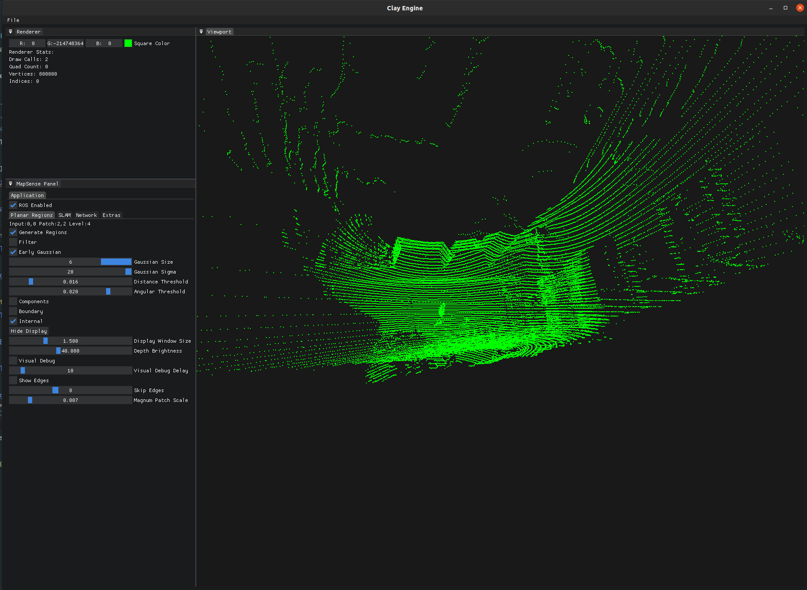

# ClayEngine

A 3D Rendering Engine for Real-time Visualization of Complex Geometry and Robotic Perception Maps.


[comment]: <> (![alt text]&#40;Images/Bunny.gif&#41; ![alt text]&#40;Images/Cylinder.gif&#41; ![alt text]&#40;Images/Surface.gif&#41;)


<p float="left">
    
    
    
</p>




## Installation

### Build from Source
Clone the repository, build the code and install at `/usr/local/include`.
```
git clone https://github.com/BhavyanshM/ClayEngine.git
cd ClayEngine
mkdir build
cd build
cmake ..
sudo make install (requires privileged access)
```

To initialize the submodules:
```
git submodule update --init --recursive
```

## Usage
### Cmake
Link `ClayEngine` as a static library into your CMake project. Use `src/ClayEditor/EditorLayer.cpp` as a guide to use the engine in your application.

Add the CMake arg `-DBUILD_LOCAL=true` to set the asset paths correctly for running locally.

## Development
Developed by Bhavyansh Mishra